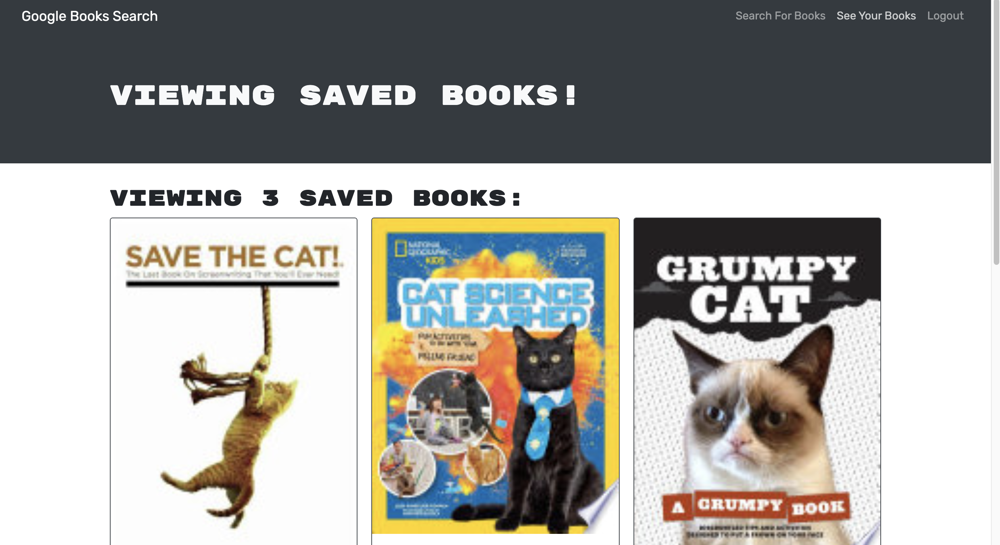

# React Portfolio

## User Story

```
AS AN avid reader
I WANT to search for new books to read
SO THAT I can keep a list of books to purchase
```

## Description

When the user opens the application, they are presented with a menu with the options to Search for a Book and Login/Sign Up. If a user tries to search for a book, they are presented with an input field and a submit button. They can search for a book while not being logged in, but they will not be able to save books. The search results will show a card with the book's title, author, description, image, and a link to that book on the Google Books site.

In order to save a book, the user must be logged in. To sign up, the user will input their username, email address, and a password. Once they sign up then they are logged in to the site. To log in, the user submits their email and password.

Once logged in, the user can search for a book and save a book by clicking the "Save" button. If the user clicks on the option to see their saved books then they are presented with cards that have all of the book information for books that were saved. If the user wants to delete the book from their saved books, they can click the delete button.

When they are done, the user has the ability to log out.

## Table of Contents

- [Deployed Site](#deployedsite)

- [Screenshot](#screenshot)

- [Contribution](#contribution)

- [Questions](#questions)

## Deployed Site

Please visit the deployed site [here](https://thawing-temple-65053.herokuapp.com/).

## Screenshot



## Contribution

All contributions are welcome. Please visit the [issues](https://github.com/pmac16/book-search-engine/issues) tab to contribute.

## Questions

If you have additional questions, please visit me on [Github](https://github.com/pmac16)
